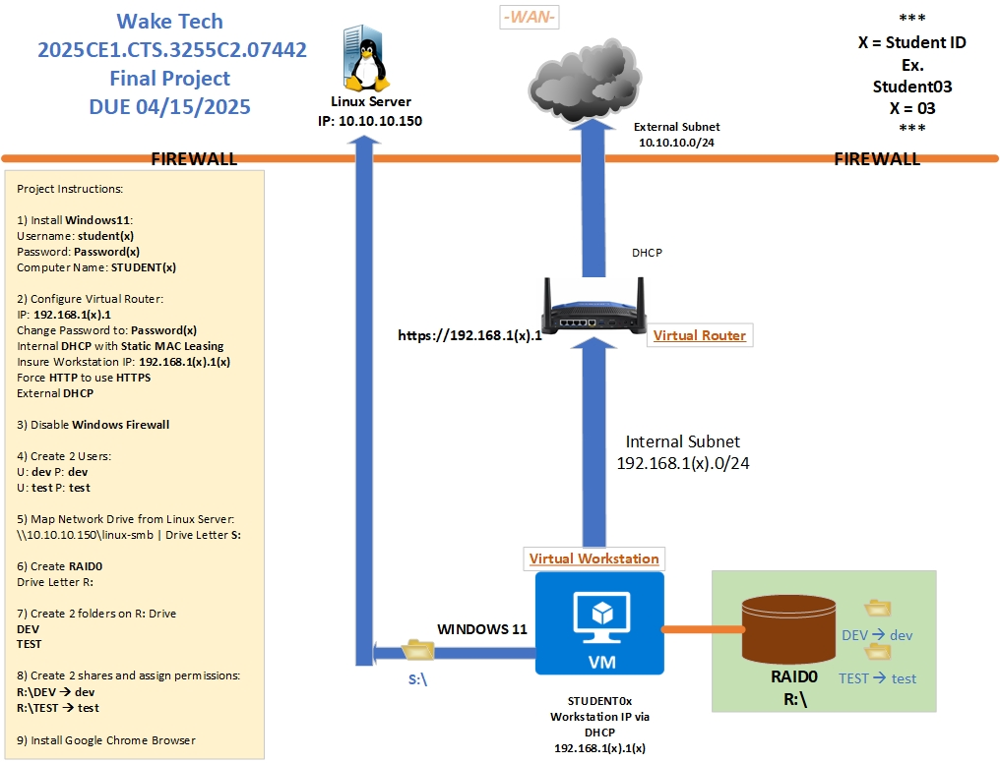

# WAKE TECH - Class Project Spring 2025
2025CE1.CTS.3255C2.07442

  DUE: 04/15/2025

### Instructions:

 

#### 1) Install Windows11 
Username: student(x) 
Password: Password(x) 
Computer Name: STUDENT(x) 

#### 2) Configure Virtual Router - Default username is (admin), Default password is (password), Default IP Address is (192.168.0.1) 
IP: 192.168.1(x).1 
Change Password to: Password(x) 
Internal DHCP with Static MAC Leasing 
Insure Workstation IP: 192.168.1(x).1(x) 
Force HTTP to use HTTPS 
External DHCP 

#### 3) Disable Windows Firewall

#### 4) Create 2 Users 
Username: dev Password: dev 
Username: test Password: test 

#### 5) Map Network Drive from Linux Server 
\\10.10.10.150\linux-smb 
Drive Letter S: 

#### 6) Create RAID0 
Drive Letter R: 

#### 7) Create 2 folders on R: Drive 
DEV 
TEST 

 

#### 8) Create 2 shares and assign permissions to users
R:\DEV --> Username: dev 
R:\TEST --> Username: test 

#### 9) Install Google Chrome Browser
 

