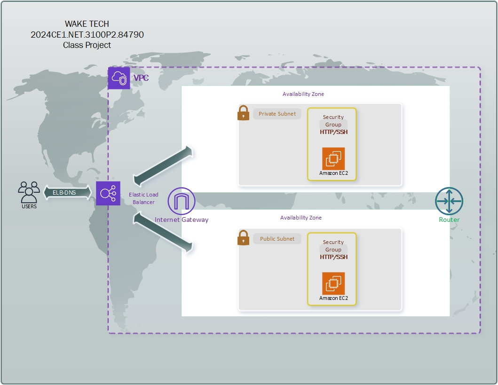

# WAKE TECH - Class Project Summer 2024
2024CE3.NET.3100P2.93221

Student Group Chart

| Group-A | Group-B | Group-C | Group-D | Group-E | Group-F |
|---------|---------|---------|---------|---------|---------|
| -       | -       | -       | -       | -       | -       |
| -       | -       | -       | -       | -       | -       |
| -       | -       | -       | -       | -       | -       |

<br />
 <br />



## Objective (DUE September 4th, 2024)
<br />

Create 2 EC2 Linux (Webserver) instances, each inside a new VPC within a public and a private subnet, across 2 availability zones, and configure them behind a load balancer. Your EC2 instances should be accessible from the ELB.
 <br />

When users hit your ELB, the page should display the following for each EC2 instance:

**INSTANCE_ID<br />
INSTANCE_AZ<br />
INSTANCE_TYPE<br />
INSTANCE_REGION<br />**

<br />
 <br />

####  Use the EC2 userdata below for your webserver to create the required output

```
#!/bin/bash

cd /tmp/

curl https://raw.githubusercontent.com/naztyroc/resume/master/aws-cloud-user-data/sample01-hello-world-region-az.sh | bash
```
