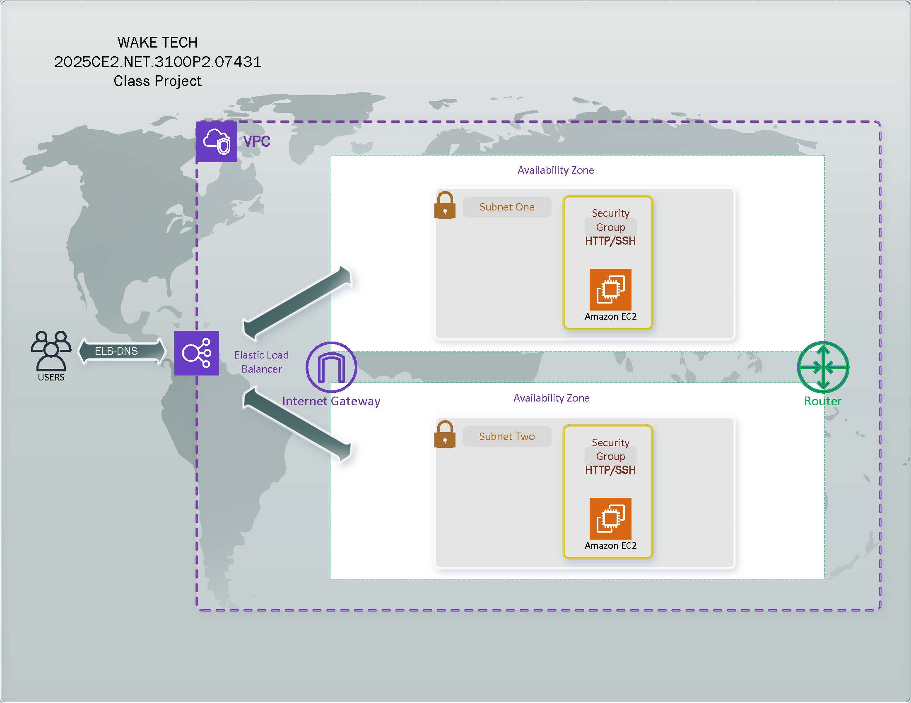

# WAKE TECH - Class Project Spring 2025
2025CE2.NET.3100P2.07431

Student Group Chart

| Group-A                            | Group-B        | Group-C         | Group-D          | Group-E          | 
|------------------------------------|----------------|-----------------|------------------|------------------|
| James Campbell                     | Brian Cotten   | Shermon Gardner | Jorge Gomez      | Nicholas Goshay  |
| Sakshi Sakshi                      | Ana Pagliro    | Mireille Tyadi  | August McConnell | Danille Williams |
| Alexander Rowe / Khanh Long Nguyen | Prajwal Shakya | Cody Fagan      | Bryce Roberson   | Collins Senaya   |

<br />
 <br />



## Objective (DUE May 21th, 2025)
<br />

Create 2 EC2 Linux (Webserver) instances, each inside a new VPC within two public subnets, across 2 availability zones, and configure them behind a load balancer. Your EC2 instances should be accessible from the ELB.
 <br />

When users hit your ELB, the page should display the following for each EC2 instance:

**INSTANCE_ID<br />
INSTANCE_AZ<br />
INSTANCE_TYPE<br />
INSTANCE_REGION<br />**

<br />
 <br />

####  Use the EC2 userdata below for your webserver to create the required output

```
#!/bin/bash

cd /tmp/

curl https://raw.githubusercontent.com/naztyroc/resume/master/aws-cloud-user-data/sample01-hello-world-region-az.sh | bash
```
